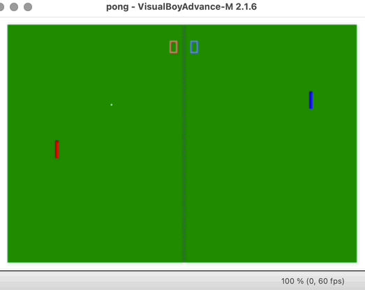
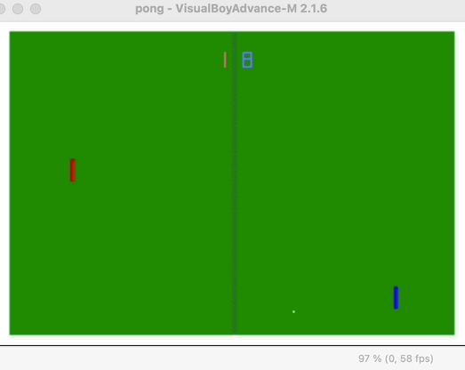
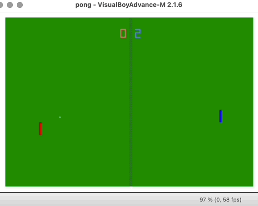

# GBA Pong

Pong clone developed in C for the Game Boy Advance.

**Author**: Joshua Williams

## Demo

# Ball Movement and Paddle Control


# CPU Scores a Point


# User Scores a Point



## Features

- **Mode 4 bitmap rendering** Palette-based 8-bit color with hardware-supported double buffering  
- **Player vs. CPU gameplay** Real-time paddle movement and position tracking  
- **Ball physics engine** Directional control, variable speed, and AI-based CPU reaction logic  
- **Digitally rendered score system** 7-segment display drawn via pixel plotting  
- **Custom collision detection** Coordinate comparisons and wall deflection logic  
- **Direct input polling** Memory-mapped GBA hardware button registers for responsive controls  

---


## Technical Highlights

- **Execution**: Runs bare-metal on GBA hardware with no operating system  
- **Graphics**: Bitmap rendering with 8-bit palette-based color and double buffering  
- **Memory Mapping**: Uses memory-mapped I/O for real-time input polling and graphics updates  
- **Timing**: Synchronizes screen updates with **VBlank** using the scanline counter  


### Requirements

- **GBA Cross-Compiler**: [`gbacc`](https://ianfinlayson.net/gba/00-setup) or [`devkitARM`](https://devkitpro.org/wiki/Getting_Started)  
- **GBA Emulator**: [mGBA](https://mgba.io/) or [VisualBoyAdvance](https://sourceforge.net/projects/vba/)  
- **Development Environment**: Native Linux setup or a preconfigured Linux-based GBA development VM  

---


### Build

Clone the repository from [https://github.com/jwilli39/GBA_Pong](https://github.com/jwilli39/GBA_Pong), then run:


```
make
```

This will produce the output file:

```
pong.gba
```

### Run

Launch the game using an emulator:

```
mgba pong.gba               # mGBA
visualboyadvance pong.gba   # VisualBoyAdvance
```

---


## Game Controls

| Action       | GBA Input   |
|--------------|-------------|
| Move Up      | D-Pad Up    |
| Move Down    | D-Pad Down  |
| CPU Paddle   | Automatic   |
| Win Game     | First to 10 |

---

## Project Structure

| File              | Description                            |
|-------------------|----------------------------------------|
| `main.c`          | Entry point                            |
| `pong.c`          | Game loop logic                        |
| `render.c`        | Ball and paddle drawing                |
| `score.c`         | Score rendering                        |
| `layout.c`        | Border and net rendering               |
| `cpu.c`           | CPU paddle AI                          |
| `collision.c`     | Collision detection                    |
| `ball_logic.c`    | Ball movement and direction            |
| `ball_state.c`    | Point detection and scoring            |
| `gba.c`           | GBA-specific helpers (put_pixel, input)|
| `Makefile`        | Compilation script                     |

---

## Flash to Hardware

To run the game on a real GBA:

1. Copy `pong.gba` to a microSD card  
2. Insert into an **EverDrive GBA** flash cartridge  
3. Insert cartridge into a real GBA  
4. Launch the ROM using the EverDrive menu  

---

## Credits

GBA hardware specs and dev tools credited to [UMW CS GBA materials](https://ianfinlayson.net/gba/)

---
